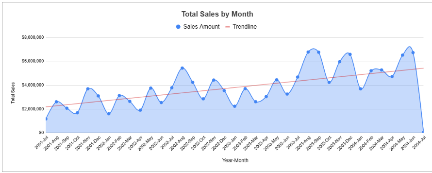
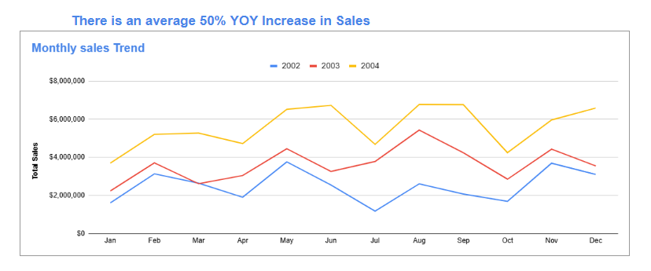
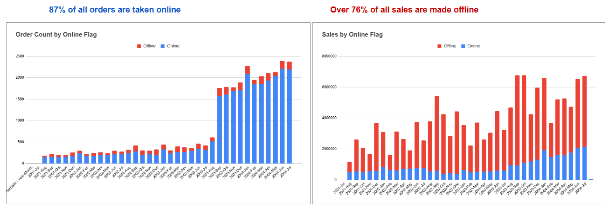

# Business Analysis Project in Googlesheet

This is a Business oriented project carried out in googlesheet.

## Tasks:
1. Business would like to see the monthly sales trend.
2. They would also like to evaluate online vs non-online orders.

   It would be nice for business to have an overview of:
1. The delivery performance trend (orderdate & Shipdate lag)
2. Top salesperson by sales, by volume.
3. Top countries.
4. Top sales reasons

In this spreadsheet I have the folllowing tables:
1. AdventureWorks.salesorderheader (with salesreasonID)
2. AdventureWorks.salesreason
3. AdventureWorks.employee (with contact data)
4. AdventureWorks.SalesTerritory

I also gave a 5 minute introduction of the Overview sheet to fellow analysts.

## Skills Demonstrated:
1. Pivot table is used.
2. Various inightful charts are used.
3. Vlookup and match/index functions.
4. Data validation or conditional formatting.
5. Good use of formatting , layout,  results highlighting.
6. Analytical approach to the problem

Here are some of the insights:

Here is the link to the [Googlesheet](https://docs.google.com/spreadsheets/d/1Bj3_QSUIZgid2VxZ16RUAj_-VLu5QIiE15DhA8jmG5U/edit?gid=1562610257#gid=1562610257)
   
